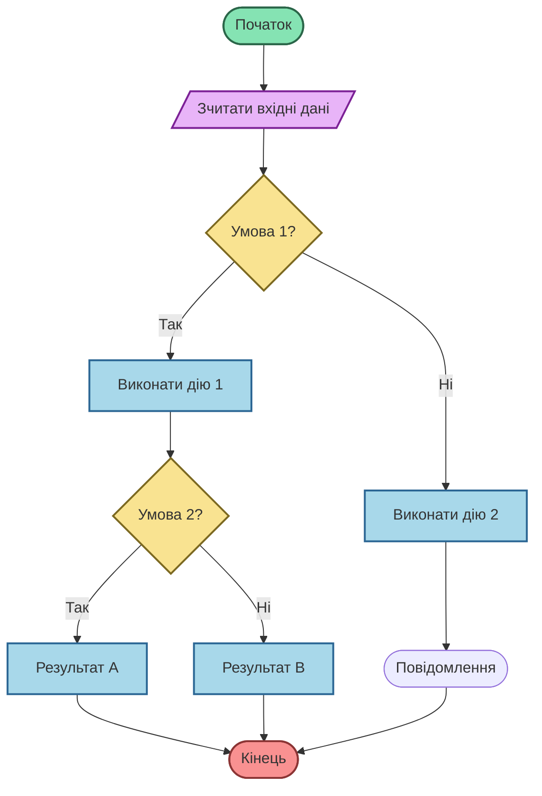

# Алгоритм_20260731_151455

```mermaid
flowchart TD
    A([Початок]) --> B[/Зчитати вхідні дані/]
    B --> C{Умова 1?}
    C -- Так --> D[Виконати дію 1]
    C -- Ні  --> E[Виконати дію 2]
    D --> F{Умова 2?}
    F -- Так --> G[Результат A]
    F -- Ні  --> H[Результат B]
    E --> I([Повідомлення])
    G --> Z([Кінець])
    H --> Z
    I --> Z
    style A fill:#85e3b3,stroke:#2b6649,stroke-width:2px
    style Z fill:#f99191,stroke:#8c3535,stroke-width:2px
    style C fill:#f9e391,stroke:#7c6921,stroke-width:2px
    style F fill:#f9e391,stroke:#7c6921,stroke-width:2px
    style B fill:#e8b4f8,stroke:#7c2196,stroke-width:2px
    style D fill:#a8d8ea,stroke:#2b6694,stroke-width:2px
    style E fill:#a8d8ea,stroke:#2b6694,stroke-width:2px
    style G fill:#a8d8ea,stroke:#2b6694,stroke-width:2px
    style H fill:#a8d8ea,stroke:#2b6694,stroke-width:2px
```
